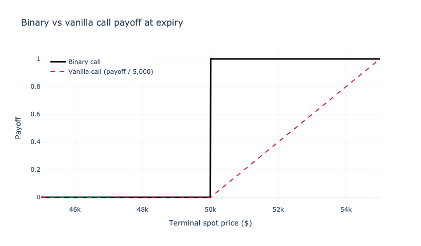
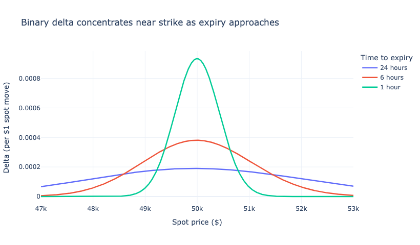
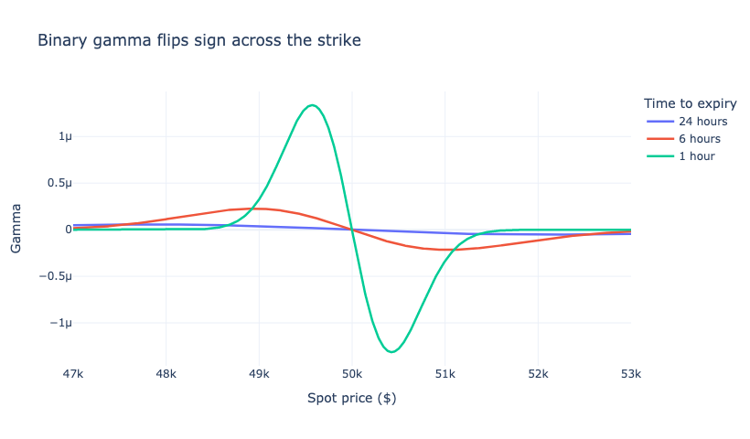
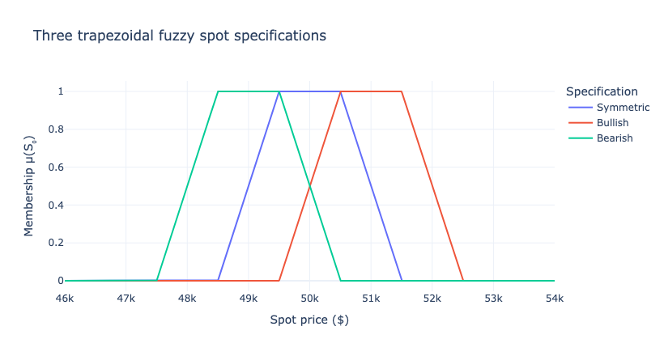
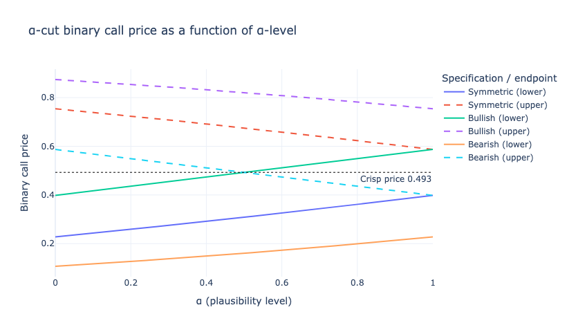

# Binary Options Pricing

Closed-form pricing of cash-or-nothing binary calls under Black-Scholes, the corresponding Greeks, and a trapezoidal-fuzzy-spot extension that produces an interval price reflecting epistemic uncertainty about the spot mid. All formulas are reproduced numerically in the companion Jupyter notebook with worked examples and inline charts.

This is the first half of a two-part series. The companion repository [`binary-options-hedging`](https://github.com/rolandgem/binary-options-hedging) builds on the pricing functions developed here to implement delta hedging, bull-spread replication, and dynamic multi-Greek portfolios.

## Companion Notebook

The notebook [`pricing.ipynb`](pricing.ipynb) implements every formula in this README:

1. Vanilla Black-Scholes call pricing and Greeks (reference point)
2. Binary call pricing, delta, gamma, vega
3. Worked example for a 24-hour BTC binary call at S = K = \$50,000, σ = 80%, r = 5%
4. Payoff diagrams contrasting vanilla and binary calls
5. Binary delta and gamma profiles at $T = 24h, 6h, 1h$
6. Trapezoidal fuzzy spot membership functions (symmetric, bullish, bearish)
7. $\alpha$-cut interval binary call prices for each specification
8. Full $\alpha$-cut envelope swept over $\alpha \in [0, 1]$

The notebook is pre-executed; charts render inline as static PNGs so they appear directly on GitHub. To re-run locally:

```bash
pip install -r requirements.txt
jupyter notebook pricing.ipynb
```

The volatility input is a stylized parameter. Override `sigma` in the constants cell for a different regime; BTC realized 24-hour volatility has ranged roughly 50% to 110% over recent cycles.

## 1. Introduction

Binary options present a unique challenge for market makers. Unlike traditional options with continuous payoffs, binary options pay a fixed amount (\$1) or nothing (\$0), creating a discontinuous payoff profile that makes hedging particularly difficult. The fundamental challenge lies in the mismatch between the discontinuous payoff of binary options and the continuous payoffs of available hedging instruments. Binary options have extreme sensitivity (gamma) near the strike price, traditional hedging instruments (spot, vanilla options) have continuous payoffs, this mismatch creates "jump risk" that cannot be perfectly hedged, and market makers must manage this risk while providing liquidity.

For this analysis, we consider 24-hour binary options on BTC price movements where the strike price equals the previous day's closing price. The payoff structure is \$1 if BTC price exceeds the strike at expiry, \$0 otherwise.

### 1.1 Market and Regulatory Context

Binary options have a contested regulatory history. The European Securities and Markets Authority prohibited the marketing, distribution and sale of binary options to retail investors via Decision (EU) 2018/795 and successive renewals; the UK Financial Conduct Authority issued a permanent ban for retail in PS19/11 (2019); the U.S. CFTC restricts binary trading to designated contract markets (Nadex, Kalshi, and a small number of venues offering event contracts). The treatment in this paper is therefore aimed at three settings where binary-style payoffs remain legitimate: (i) institutional OTC books, (ii) regulated event-contract exchanges (typically with strikes binned to fixed dollar increments), and (iii) the increasingly mature on-chain prediction-market venues such as Polymarket and Kalshi, where contracts pay \$1 or \$0 on the resolution of an event and are economically equivalent to short-dated binary options on a market-determined reference price.

Bitcoin's realized and implied volatility regimes vary substantially. The 80% annualized volatility used throughout this paper is a stylized parameter chosen to keep numerics simple; it sits roughly between the 60%-65% that prevailed in the 2025 lower-vol regime and the 100%+ readings from earlier cycles (DVOL, BVIV). Readers should treat $\sigma$ as a tunable input, not a calibration target.

## 2. Mathematical Foundations

### 2.1 Vanilla Options Pricing and Greeks

To understand the contrast with binary options, we begin with standard European options.

The Black-Scholes formula for a European call option:

$$ C = S_0 \cdot N(d_1) - K \cdot e^{-r \cdot T} \cdot N(d_2) $$

Where:

- $S_0$ = Current spot price
- $K$ = Strike price
- $r$ = Risk-free rate
- $T$ = Time to expiry
- $\sigma$ = Implied volatility
- $N(x)$ = Cumulative standard normal distribution

With:

$$ d_1 = \frac{\ln(S_0/K) + (r + \sigma^2/2) T}{\sigma \sqrt{T}}, \qquad d_2 = d_1 - \sigma \sqrt{T} $$

Vanilla option Greeks provide smooth, continuous risk measures.

**Delta** ($\Delta$): rate of change of option value with respect to spot price:

$$ \Delta_{\text{call}} = N(d_1) $$

Delta ranges from 0 to 1 and represents a smooth, continuous function of the underlying price.

**Gamma** ($\Gamma$): rate of change of delta:

$$ \Gamma = \frac{\phi(d_1)}{S_0 \sigma \sqrt{T}} $$

where $\phi(x) = \frac{1}{\sqrt{2\pi}} e^{-x^2/2}$ is the standard normal probability density function.

### 2.2 Binary Options Pricing and Greeks

Binary options have a fundamentally different payoff structure, leading to different pricing formulas.

The value of a binary call option equals the discounted risk-neutral probability of finishing in-the-money:

$$ C_{\text{binary}} = e^{-rT} N(d_2) $$

Note that this uses $d_2$, not $d_1$ like vanilla options. This is because the binary payoff depends only on whether $S_T > K$, not on how far above $K$ it finishes.

Binary option Greeks exhibit significantly different behavior.

**Binary delta:**

$$ \Delta_{\text{binary}} = \frac{\partial C_{\text{binary}}}{\partial S_0} = \frac{e^{-rT} \phi(d_2)}{S_0 \sigma \sqrt{T}} $$

**Binary gamma:**

$$ \Gamma_{\text{binary}} = \frac{\partial^2 C_{\text{binary}}}{\partial S_0^2} = -\frac{e^{-rT} \phi(d_2) d_1}{S_0^2 \sigma^2 T} $$

**Binary vega:**

$$ \mathcal{V}_{\text{binary}} = \frac{\partial C_{\text{binary}}}{\partial \sigma} = -\frac{e^{-rT} \phi(d_2) d_1}{\sigma} $$

Binary delta peaks at the strike rather than monotonically increasing in spot, and binary gamma flips sign across the strike (positive below, negative above). These properties drive every hedging difficulty discussed in the companion repository.



The contrast in payoff shape is the source of every distinction that follows. The vanilla payoff is a continuous hockey stick; the binary is a step function.



Vanilla delta would be a smooth S-curve from 0 to 1. Binary delta peaks at the strike and the peak grows sharper as $T \to 0$.



Vanilla gamma is everywhere positive. Binary gamma flips sign across the strike, which is what makes near-expiry delta hedging unstable.

### 2.3 Worked Example

Consider binary options with the following parameters:

- Spot price $S_0$ = \$50,000
- Strike price $K$ = \$50,000
- Risk-free rate $r = 5\%$ annually
- Volatility $\sigma = 80\%$ annually
- Time to expiry $T = 1/365$ (24 hours)

Calculations:

$$ d_1 = \frac{\ln(1) + (0.05 + 0.32) \cdot 1/365}{0.8 \cdot \sqrt{1/365}} = 0.0242 $$

$$ d_2 = 0.0242 - 0.8 \cdot \sqrt{1/365} = -0.0177 $$

Binary option value: $C_{\text{binary}} = e^{-0.05/365} \cdot N(-0.0177) = 0.4929$

Binary delta: $\Delta_{\text{binary}} = e^{-0.05/365} \phi(-0.0177) / (50000 \cdot 0.8 \cdot \sqrt{1/365}) = 1.90 \times 10^{-4}$ per dollar

Binary gamma: $\Gamma_{\text{binary}} = -e^{-0.05/365} \phi(-0.0177) \cdot 0.0242 / (50000^2 \cdot 0.8^2 \cdot 1/365) = -2.20 \times 10^{-9}$ per dollar squared

For a position of 10,000 binary options (each with \$1 maximum payout):

- Total position value: 10,000 × \$0.4929 = \$4,929
- Total delta: $10{,}000 \times 1.90 \times 10^{-4} = 1.90$ (dimensionless), corresponding to a \$1 P&L per \$1 spot move per unit of delta
- BTC-equivalent hedge: short the binary, then buy $\Delta_{\text{total}} = 1.90$ BTC
- Capital deployed for the hedge: 1.90 × \$50,000 = \$95,120

These numerical values are reproduced exactly by the companion notebook.

## 3. Fuzzy Number Approach to Binary Option Pricing

Standard binary option pricing assumes a single observable spot $S_0$ and a fully specified law for $S_T$. In practice two layers of uncertainty intrude: aleatory (the random walk of $S_T$ given a known distribution, which $\sigma$ captures) and epistemic (uncertainty about the parameters or the model itself). For crypto specifically, the epistemic layer is non-trivial: the spot mid-price is ambiguous across venues and through bid-ask, the lognormal model is itself approximate, and the choice of $\sigma$ is contested between realized and implied estimators.

Fuzzy set theory [Yoshida, 2003; Wu, 2004; Thavaneswaran et al., 2009; Buckley and Eslami, 2008] provides a way to encode the epistemic layer without specifying a tractable second-order distribution over distributions. We illustrate with fuzzy current spot $\tilde{S}_0$; the same $\alpha$-cut machinery applies to fuzzy strike or fuzzy volatility.

### 3.1 Trapezoidal Fuzzy Spot

A fuzzy number $\tilde{S}_0$ is characterised by its membership function $\mu : \mathbb{R} \to [0, 1]$. The trapezoidal form has core $[S_a, S_b]$ (full plausibility, $\mu = 1$) and support $[S_a - \gamma, S_b + \beta]$ (positive plausibility) with linearly interpolated edges:

$$
\mu(s) = \begin{cases}
0 & \text{if } s < S_a - \gamma \\
\frac{s - (S_a - \gamma)}{\gamma} & \text{if } S_a - \gamma \leq s < S_a \\
1 & \text{if } S_a \leq s \leq S_b \\
\frac{(S_b + \beta) - s}{\beta} & \text{if } S_b < s \leq S_b + \beta \\
0 & \text{if } s > S_b + \beta
\end{cases}
$$

The $\alpha$-cut at level $\alpha \in [0, 1]$ is the set of values with at least $\alpha$ plausibility:

$$ A(\alpha) = \{s : \mu(s) \geq \alpha\} = [S_a - \gamma(1-\alpha), S_b + \beta(1-\alpha)] $$

At $\alpha = 1$ only the core remains; at $\alpha = 0$ the full support.



### 3.2 The $\alpha$-cut Binary Price

The crisp Black-Scholes binary call price is monotone increasing in $S_0$. The $\alpha$-cut binary price is therefore the closed interval

$$ C(\alpha) = \big[\, e^{-rT} N(d_2(a(\alpha))),\ e^{-rT} N(d_2(b(\alpha))) \,\big] $$

with $a(\alpha) = S_a - \gamma(1-\alpha)$, $b(\alpha) = S_b + \beta(1-\alpha)$, and $d_2$ evaluated at the corresponding endpoint spot. The interval is widest at $\alpha = 0$ (full support) and tightest at $\alpha = 1$ (core only). For directional fuzzy views (core not centered on the crisp spot), the interval is asymmetric around the crisp price.

### 3.3 Numerical Comparison

For the running parameters ($K$ = \$50,000, $\sigma = 80\%$, $T = 1/365$, $r = 5\%$, crisp spot $S_0$ = \$50,000 giving crisp price $0.4929$), we evaluate three trapezoidal specifications, each with width parameters $\gamma = \beta$ = \$1,000:

| Specification | Core | $C(\alpha=1)$ | $C(\alpha=0.5)$ | $C(\alpha=0)$ | Crisp |
|---|---|---|---|---|---|
| Symmetric | $[49{,}500, 50{,}500]$ | $[0.399, 0.587]$ | $[0.309, 0.675]$ | $[0.228, 0.754]$ | $0.493$ |
| Bullish core | $[50{,}500, 51{,}500]$ | $[0.587, 0.754]$ | $[0.493, 0.821]$ | $[0.399, 0.874]$ | $0.493$ |
| Bearish core | $[48{,}500, 49{,}500]$ | $[0.228, 0.399]$ | $[0.166, 0.493]$ | $[0.107, 0.587]$ | $0.493$ |

The crisp price is the same in all rows because the trapezoidal shapes are symmetric in $\gamma$ and $\beta$. The intervals widen monotonically as $\alpha$ falls and shift directionally with the core.



Sweeping $\alpha$ from 0 to 1 traces out the full interval price as a function of plausibility level. The lower and upper bounds bracket the crisp price (when the trapezoidal is centred on it) or sit asymmetrically around it (for directional views).

### 3.4 Use Case: Quote Spread from Epistemic Uncertainty

A market maker can quote bid and ask using $C(\alpha = \alpha^{\star})$ for some chosen confidence level $\alpha^{\star}$. The interval width $\overline{C}(\alpha^{\star}) - \underline{C}(\alpha^{\star})$ encodes the trader's epistemic uncertainty about $S_0$ directly, in price units, rather than tuning a spread multiplier ad hoc. The width composes naturally with the hedging-cost and inventory-skew terms developed in the companion hedging article: total quoted spread = epistemic spread (from $\alpha$-cut) + hedging cost + residual risk premium + profit margin.

The trapezoidal width parameters $\gamma$ and $\beta$ should be calibrated externally rather than fitted: cross-venue spot dispersion, mid-bid spread on the underlying, realized-vs-implied vol gap, or strike-by-strike disagreement in prediction markets are all sensible inputs.

### 3.5 Caveats

- The fuzzy price is not a no-arbitrage price. The membership function is epistemic, not a Radon-Nikodym derivative. The construction belongs to the broader family of interval-valued and coherent risk pricing approaches.
- Fuzzifying volatility ($\tilde{\sigma}$) instead of spot is a valid alternative, but the binary price is not monotone in $\sigma$ across all strike-spot configurations, so $\alpha$-cut endpoints require interior optimization.
- Adaptive (non-linear) membership functions replace the linear edges with $1 - ((S_a - s)/\gamma)^n$ and $1 - ((s - S_b)/\beta)^m$. Larger $n$ and $m$ encode sharper transitions (higher confidence in the core boundaries); smaller values encode softer beliefs.

## References

- Black, F., and Scholes, M. (1973). The Pricing of Options and Corporate Liabilities. *Journal of Political Economy*, 81(3), 637-654.
- Hull, J. C. (2018). *Options, Futures, and Other Derivatives* (10th ed.). Pearson.
- Yoshida, Y. (2003). The valuation of European options in uncertain environment. *European Journal of Operational Research*, 145(1), 221-229.
- Wu, H.-C. (2004). Pricing European options based on the fuzzy pattern of Black-Scholes formula. *Computers and Operations Research*, 31(7), 1069-1081.
- Thavaneswaran, A., Appadoo, S. S., and Paseka, A. (2009). Weighted possibilistic moments of fuzzy numbers with applications to GARCH modeling and option pricing. *Mathematical and Computer Modelling*, 49(1-2), 352-368.
- Buckley, J. J., and Eslami, E. (2008). Pricing stock options using fuzzy sets. *Iranian Journal of Fuzzy Systems*, 5(2), 1-17.
- European Securities and Markets Authority (2018). Decision (EU) 2018/795 of 22 May 2018 to temporarily prohibit the marketing, distribution or sale of binary options to retail clients in the Union.
- Financial Conduct Authority (2019). *Policy Statement PS19/11: Product intervention measures for retail binary options*. London: FCA.
- U.S. Commodity Futures Trading Commission. Designated Contract Markets (DCMs). [cftc.gov/IndustryOversight/TradingOrganizations/DCMs](https://www.cftc.gov/IndustryOversight/TradingOrganizations/DCMs).

